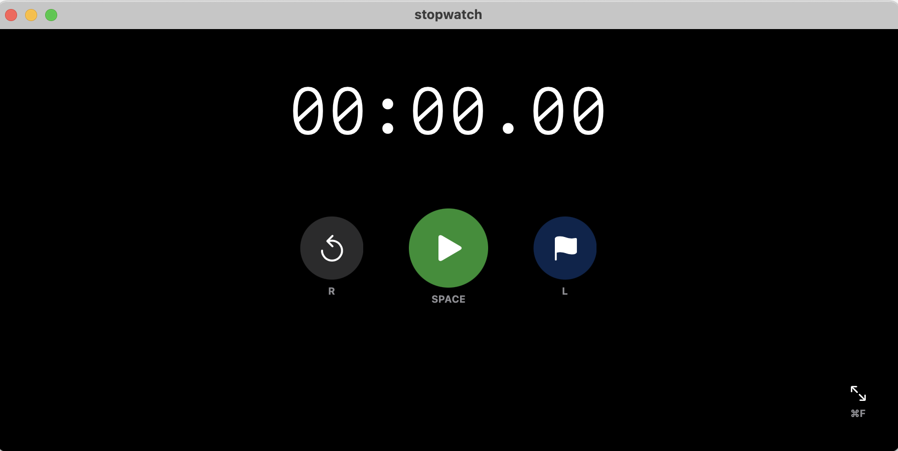

# Stopwatch

A minimalist, fullscreen stopwatch application for macOS built with Swift and SwiftUI.



## Features

- **Clean, Minimalist UI**: Large, readable stopwatch display with simple controls
- **Fullscreen Support**: Works in both windowed and fullscreen modes
- **Always-on-Top**: Stays visible on top of other windows
- **Responsive Design**: UI scales beautifully with window size and resolution
- **Lap Timing**: Record and display lap times
- **Keyboard Shortcuts**: Control the stopwatch without using the mouse
- **Visual Feedback**: Clear animations when keyboard shortcuts are triggered

## Project Structure

```
Stopwatch/
├── StopwatchApp.swift     # Main app entry point
├── AppDelegate.swift      # Window configuration
├── ContentView.swift      # Main UI
└── StopwatchManager.swift # Timer logic
```

## Requirements

- macOS 11.0 (Big Sur) or later
- 64-bit processor

## Usage

- **Starting/Stopping the Timer**: Click the large center button or press the `Space` bar
- **Resetting the Timer**: Click the reset button (leftmost) or press the `R` key
- **Recording a Lap**: Click the lap button (rightmost) or press the `L` key
- **Toggle Fullscreen**: Click the fullscreen button in the lower right or press `⌘F`

## Keyboard Shortcuts

| Action          | Shortcut |
|----------------|----------|
| Start/Stop     | `Space`  |
| Reset          | `R`      |
| Record Lap     | `L`      |
| Toggle Fullscreen | `⌘F`  |
| Quit           | `⌘Q`     |

## Technical Details

- **Swift and SwiftUI**: Built using Swift 5.5+ and SwiftUI for a modern, native experience
- **Dark Mode**: Designed for dark environments for better visibility
- **Timer Precision**: Uses high-precision timer for accurate stopwatch functionality
- **Window Management**: Uses `NSWindow` and `AppKit` for window level controls
- **Responsive Text**: Dynamically adjusts text size based on available space

